# DoN Range labs for Labtainers: student setup guide

This repository is the distribution point for the instructor-provided Labtainers module
(the "imodule") and the `donlab` launcher used by the DoN Range lab family for CS3600,
CS3670 and CS3690. The launcher fetches what it needs from here at every lab start.
Students do not need to clone this repository.

The sections below take you from nothing installed to a running lab.

1. [Which image do I use?](#1-which-image-do-i-use)
2. [Get a Labtainers VM running](#2-get-a-labtainers-vm-running)
3. [First boot: verify that Labtainers works](#3-first-boot-verify-that-labtainers-works)
4. [Running a lab with the donlab launcher](#4-running-a-lab-with-the-donlab-launcher)
5. [Troubleshooting](#5-troubleshooting)

## 1. Which image do I use?

Labtainers runs inside a Linux virtual machine. Pick the image that matches your hardware.

| Your computer | Image to use | Where it comes from |
|---|---|---|
| Windows or Linux on an Intel or AMD processor; Intel-based Mac | The official NPS x86_64 appliance (VirtualBox or VMware) | [NPS virtual machine images](https://nps.edu/web/c3o/virtual-machine-images) |
| Apple Silicon Mac (M1, M2, M3, M4) | Our native arm64 appliance for UTM (also provided as `.qcow2` and `.ova`) | The OneDrive folder linked from [Labtainer-ARM-mac](https://github.com/spencer-dollahite/Labtainer-ARM-mac) |
| Windows with Hyper-V | The VHDX image listed on the NPS page (marked as work in progress there) | [NPS virtual machine images](https://nps.edu/web/c3o/virtual-machine-images) |
| A machine that cannot meet the requirements (low memory, no virtualization support) | A Labtainers cloud VM, accessed from a browser | Section 5, "Cloud Labtainers", of the [Labtainers Student Guide](https://github.com/mfthomps/Labtainers/raw/master/docs/student/labtainer-student.pdf) |

Apple Silicon note: the NPS page also offers an x86_64 QCOW2 image that UTM can run under
emulation. It runs every Labtainers lab, but slowly. The native arm64 appliance is the
recommended route for this course; the labs are published for arm64. The
[Labtainer-ARM-mac](https://github.com/spencer-dollahite/Labtainer-ARM-mac) guide covers both
routes in detail.

## 2. Get a Labtainers VM running

### 2a. The official NPS appliance (x86_64: VirtualBox, VMware)

The images, their checksums and brief import instructions are published at
[nps.edu/web/c3o/virtual-machine-images](https://nps.edu/web/c3o/virtual-machine-images).
The [Labtainers page](https://nps.edu/web/c3o/labtainers) links the Student Guide, the
lab manuals and a video tutorial on installation.

VirtualBox:

1. Install VirtualBox from [virtualbox.org](https://www.virtualbox.org/wiki/Downloads).
2. Download the VirtualBox appliance (`LabtainerVM24a-VirutalBox.ova` at the time of
   writing; the file name is spelled that way on the NPS page).
3. Compare the file's SHA-256 checksum with the value on the NPS page.
4. In VirtualBox choose **File > Import Appliance** (the **Import** toolbar button does the
   same).

   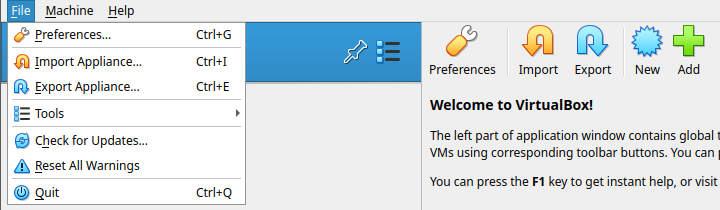

5. Leave **Source** at Local File System, pick the `.ova` in the **File** field and click
   **Next**.

   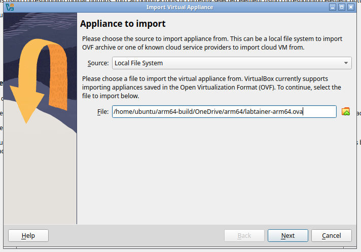

6. The **Appliance settings** page lists the VM the file contains. Accept the defaults and
   click **Finish**.

   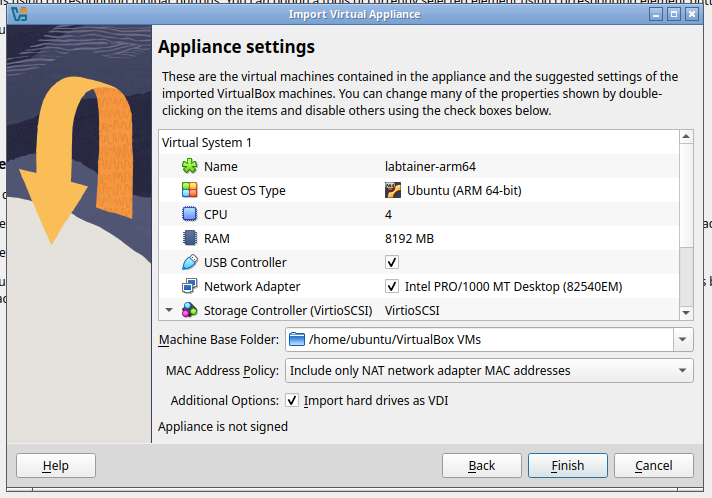

7. The import runs for a few minutes; the progress shows in the notification panel on the
   right of the main window. The VM then appears in the list on the left.

   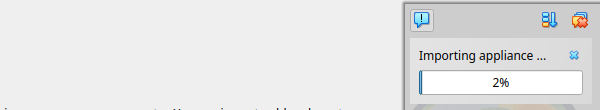

8. Select the VM and click **Start**.

*The screenshots show VirtualBox 7.1 importing our arm64 `.ova`; the NPS x86_64 file goes
through the same dialogs.*

VMware (Workstation, Player or Fusion):

1. Install VMware Workstation, Player or Fusion.
2. Download the VMware appliance (`LabtainerVM24a-VMWare.ova` at the time of writing).
3. Compare the file's SHA-256 checksum with the value on the NPS page.
4. Choose **File > Open** (Workstation, Player) or **File > Import** (Fusion), select the
   `.ova` file and accept the defaults.
5. Start the VM.

<!-- TODO screenshot: VMware File > Open / Import dialog with the Labtainers .ova selected (docs/img/vmware-import.png) -->

The appliance is configured to not perform Ubuntu system updates automatically. Decline the
update prompt if one appears; the updates are not needed for the labs.

### 2b. Our arm64 appliance (Apple Silicon: UTM, VirtualBox, VMware Fusion)

The appliance is publicly hosted in this
[NPS OneDrive folder](https://nps01-my.sharepoint.com/:f:/g/personal/spencer_dollahite_nps_edu/IgAZgs-majINRZLvHu-oPPj0AQei1zJ9S0xHeJThBPQamjE).
Take the `.utm.zip` for UTM, or the `.qcow2` or `.ova` if you use another hypervisor. Each
file has a `.sha256` checksum beside it. The full guide, including the emulated x86_64
alternative and the instructor build notes, is
[Labtainer-ARM-mac](https://github.com/spencer-dollahite/Labtainer-ARM-mac); the essentials
are repeated here.

Minimum requirements. The appliance runs a full Linux desktop plus Docker containers. The
VM itself is configured for 4 CPU cores and 8 GB of RAM; leave the rest for macOS.

| | Minimum | Recommended |
|---|---|---|
| Mac | Any Apple Silicon (M series) | Apple Silicon with performance cores to spare |
| macOS | 13 (Ventura) | Current release |
| RAM | 16 GB | 32 GB (a 16 GB Mac works but is tight while the 8 GB VM and macOS both run) |
| Free disk | ~40 GB | 60 GB or more (the download is ~5 GB, expands to a ~40 GB disk, and each lab pulls its Docker images on first run) |

UTM:

1. Install UTM from [mac.getutm.app](https://mac.getutm.app/) (free, no account).
2. Download the `.utm.zip` from the OneDrive folder.
3. Verify it: in Terminal, `shasum -a 256 ~/Downloads/<file>.utm.zip`, and compare with the
   `.sha256` file beside it.
4. Unzip the file. You get a `.utm` bundle.
5. Double-click the `.utm` bundle (or in UTM choose **File > Open**). UTM imports it into its
   library. The bundle is pre-configured: **Virtualize**, **aarch64**, 4 cores, 8 GB RAM,
   UEFI boot, **Emulated VLAN** networking, and clipboard sharing with macOS. Do not change
   the architecture, reduce the memory below 8 GB, or switch the network mode.
6. Start the VM and log in with the credentials supplied with the download.

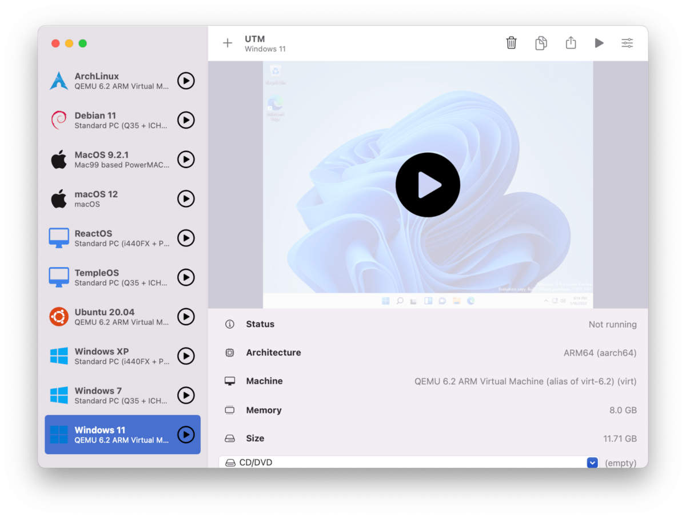

*The UTM library after an import: the VM in the list on the left, its settings summary on
the right, and the Start button in the toolbar. Screenshot from the UTM project site
([utmapp/mac.getutm.app](https://github.com/utmapp/mac.getutm.app), MIT); the imported
Labtainers VM appears in the same way.*

VirtualBox (7.1 or newer for Apple Silicon) or VMware Fusion: import the `.ova` as-is.
Fusion downloads require a Broadcom account. Both support snapshots; UTM does not, so keep a
copy of the unzipped `.utm` bundle if you want a way to roll back.

If the VM loses its network after the Mac sleeps or changes Wi-Fi, shut the VM down and
start it again.

## 3. First boot: verify that Labtainers works

1. Log in. For the NPS x86_64 appliance the NPS images page states the user id `student`
   and the password `password123`. For the arm64 appliance use the credentials supplied
   with the download.
2. On first boot the appliance updates Labtainers itself; allow it to finish. The Student
   Guide notes that the prepackaged VMs then open a terminal in the Labtainers workspace
   directory, with some hints.

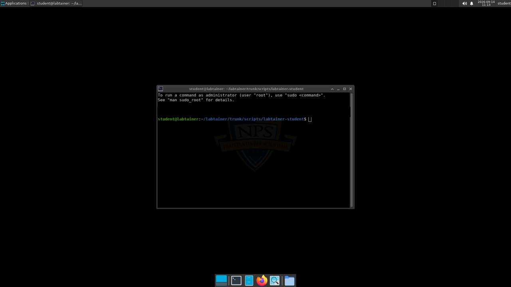

*The arm64 appliance after first boot: it logs in automatically and opens a terminal in the
Labtainers workspace directory. The NPS x86_64 appliance shows a login screen first, then
the same kind of terminal.*

3. All labs are run from the workspace directory. If you open a new terminal, change to it
   first:

   ```bash
   cd $LABTAINER_DIR/scripts/labtainer-student
   ```

   On the NPS appliance this is `~/labtainer/trunk/scripts/labtainer-student`; the
   appliance also provides the shortcut `~/labtainer/labtainer-student`.

4. Confirm the framework answers:

   ```bash
   labtainer -h      # command help
   labtainer         # no arguments: lists the labs installed on this VM
   labtainer -d      # diagnostics on the environment Labtainers expects
   ```

5. `update-labtainer.sh` updates the framework itself (bug fixes and the stock labs). Run it
   when your instructor asks you to, or when the VM image is older than the current
   Labtainers release. `donlab --update-labtainers` (section 4) runs the same updater.

Do not run more than one lab at a time; the Student Guide states that results are not
reliable when labs overlap.

## 4. Running a lab with the donlab launcher

`donlab` is a single script. You receive it from the course LMS. The copy in this
repository is a keyless copy: it is what the launcher fetches to update itself, and on its
own it cannot decrypt the lab bundle. Use the copy from the LMS.

### 4.1 Install the launcher

1. Get `donlab` into the VM. Practical ways:
   - Open Firefox inside the VM, log in to the LMS and download it there (no host-to-VM
     transfer needed).
   - Paste it in with vim. On the host, open the `donlab` file from the LMS in a text
     editor and copy its entire contents. In the VM:

     ```bash
     cd $LABTAINER_DIR/scripts/labtainer-student
     vim donlab
     ```

     In vim type `:set paste` and press Enter, press `i`, paste the clipboard into the
     terminal, press `Esc`, then type `:wq` and press Enter. Make it executable and let it
     fetch and verify its own published copy:

     ```bash
     chmod +x donlab
     ./donlab -u
     ```

     `-u` forces the self-update: the launcher downloads the published copy from this
     repository, checks its checksum, keeps your key, and replaces the pasted file. A
     successful `-u` confirms the paste was intact. Then go on to section 4.2.
   - Drag and drop, or a shared folder, if your hypervisor's guest tools are installed
     (VirtualBox Guest Additions, VMware Tools; UTM shares the clipboard, not files, by
     default).
2. If you downloaded or copied the file rather than pasting it, put it in the Labtainers
   workspace directory and make it executable:

   ```bash
   mv ~/Downloads/donlab $LABTAINER_DIR/scripts/labtainer-student/
   cd $LABTAINER_DIR/scripts/labtainer-student
   chmod +x donlab
   ```

   The launcher locates the Labtainers tree itself and changes into this directory when
   run from elsewhere, so another location in your home directory also works. The file must
   remain writable by you for the self-update to apply.

### 4.2 Start a lab

```bash
./donlab cs3670-lab1
```

What happens, in order (each step prints a `==>` line):

1. **Self-update.** The launcher fetches the published copy from this repository, verifies
   its checksum, keeps your local key and channel, and replaces itself if the published copy
   is newer. Failures (offline, bad checksum, read-only file) are ignored and the copy on
   disk is used.
2. **Lab bundle.** It compares the published `imodule.tar.enc.sha256` with the version
   installed on the VM. If they differ it downloads the bundle, verifies the checksum,
   decrypts it and installs it with the framework's `imodule` command. Otherwise it prints
   `Lab bundle is already up to date`.
3. **Images.** It checks the container registry for updated images for this lab and
   downloads any that changed. On Apple Silicon it installs the lab's arm64 images; a lab
   with no arm64 build is refused up front.
4. **Start.** It runs `labtainer <lab>`. The first start of a lab downloads that lab's
   container images and can take several minutes. The framework then shows the scenario
   brief and waits for Enter.
5. **Manual.** It opens the lab manual in Firefox.
6. **Layout.** It lays the lab out in one tmux session: one window per host you use, one
   pane per terminal that host was given, and attaches you to it.

The first time you start any lab the framework asks for your e-mail address. It becomes part
of the file name of your submission archive, so use the address your instructor specifies
(your official institution e-mail is a good default unless told otherwise).

The first start, showing the bundle download and installation followed by the image pull:

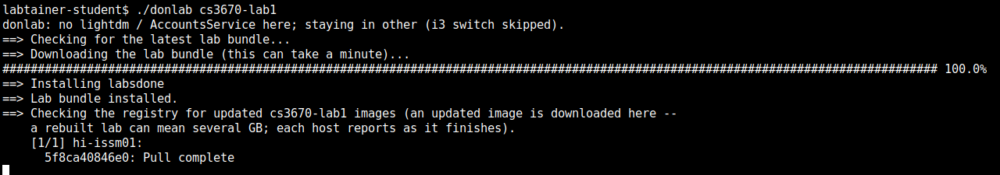

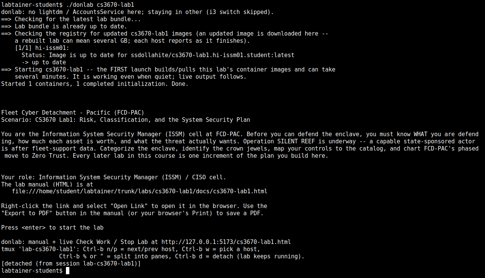

*Captured on a development machine, so the i3 switch is skipped and the manual path
shown in the second image has been replaced with the appliance path
(`/home/student/labtainer/trunk/labs/<lab>/docs/<lab>.html`).*

### 4.3 The manual

Firefox opens the manual for the lab. The sidebar tracks your progress; **Bearings** holds
the scenario's credentials and hosts; **Actions** runs Check Work, Stop Lab and Reset Lab
against the running lab; **Download Lab Report** exports your answers and screenshots as
the PDF you submit.

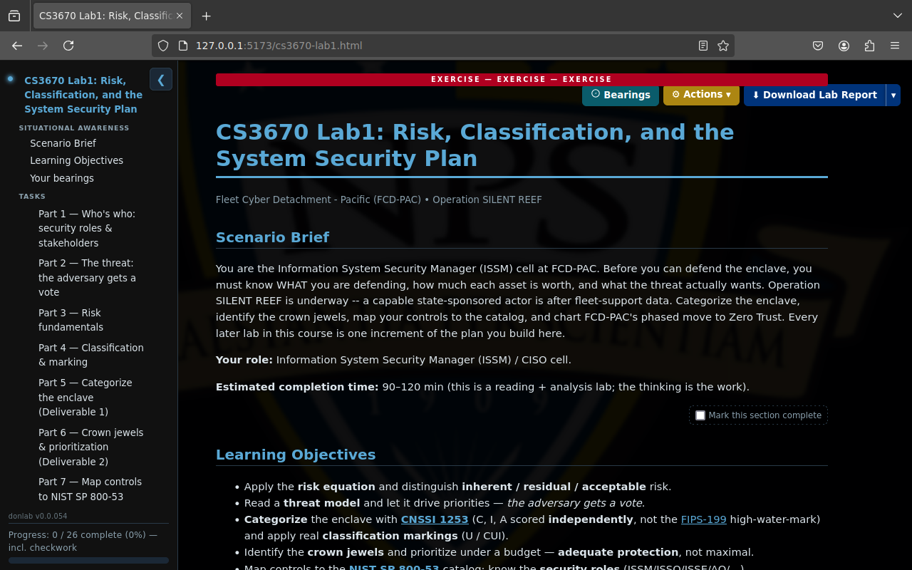

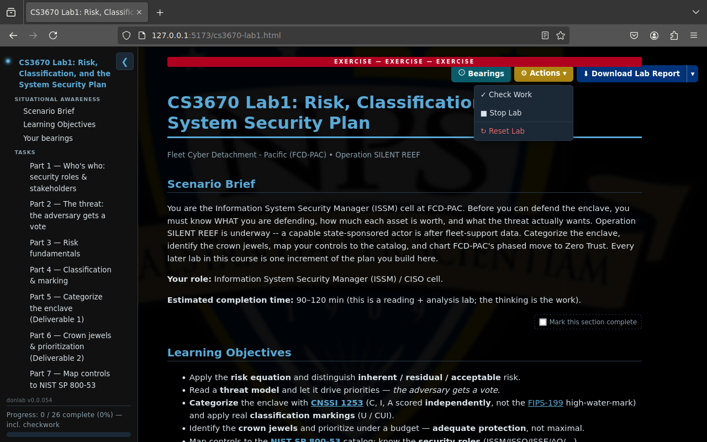

### 4.4 The tmux layout

The launcher lays the lab out in one tmux session, one window per host, named after the
host. The status line at the bottom lists the windows:

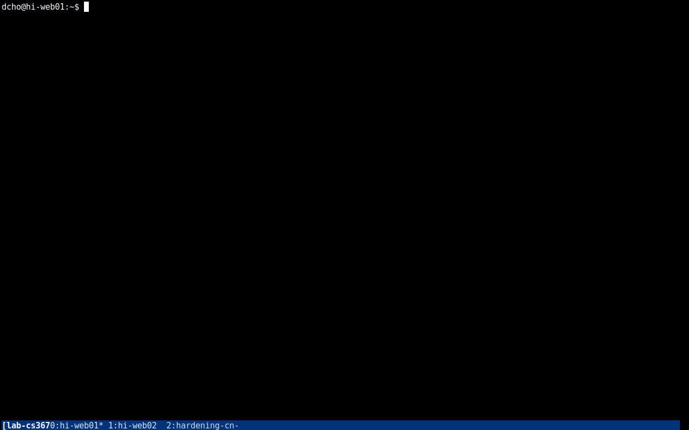

The tmux keys and the i3 desktop are covered in the FAQ at the bottom of every lab manual.
Prefer the framework's separate pop-up terminal windows? Run `./donlab <lab> --no-tmux`.

### 4.5 Stop the lab and submit

Stop the lab from the workspace directory, or with **Actions > Stop Lab** in the manual:

```bash
stoplab cs3670-lab1
```

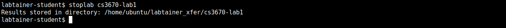

`stoplab` writes your submission archive, a file with the `.lab` extension, under
`~/labtainer_xfer/<lab>/` and prints that directory. Your work is preserved; re-running
`./donlab <lab>` resumes the lab where you left it. You submit two files to the LMS unless
your instructor says otherwise: the `.lab` archive and the Lab Report PDF exported from the
manual. If the LMS rejects the `.lab` for size, upload the PDF and send the `.lab` to your
instructor by the route given in your course instructions.

`checkwork <lab>` shows how the graded goals are scoring while the lab runs. To discard your
work and start the lab from scratch: `./donlab <lab> -r`.

### 4.6 Other launcher commands

| Command | Effect |
|---|---|
| `./donlab --doctor` | Readiness check: Docker daemon, X display, clipboard, registry reachability, free disk, vim and tmux. |
| `./donlab -v` | Print the launcher version, channel and build id. |
| `./donlab -u` | Force a self-update check now and report the outcome. |
| `./donlab --update-labtainers` | Run the NPS `update-labtainer.sh` framework updater. |
| `./donlab --reset <lab>` | Discard the lab's containers and networks, then start it fresh. |
| `DONLAB_NO_PULL=1 ./donlab <lab>` | Skip the registry check for updated images for this run. |

## 5. Troubleshooting

If a problem is not resolved by the answers below, spend 5 to 15 minutes at most searching
the internet or asking an AI assistant on your own. If it is still unresolved after that,
reach out to your instructor rather than continuing to struggle with it.

**Can I run `./donlab <lab>` again on a lab that is already running or stopped?**
Yes. It resumes the lab. The bundle and image checks are no-ops when nothing changed, and
the tmux layout is rebuilt from the running containers.

**What happens if the VM has no network?**
The self-update and the bundle check are skipped with a `WARN: ... using installed
version` line, and the lab starts from the installed bundle and the images already on the
VM. The first start of a lab does need network access to pull its images. On UTM, a VM that
shows `Network is unreachable` after the Mac slept needs a shutdown and restart; keep the
network mode at Emulated VLAN.

**The launcher says `WARN: decrypt failed; using installed version`. Why?**
You are running the keyless copy from this repository. Use the `donlab` posted on the LMS.

**The VM rebooted during the first run. Is something wrong?**
No. A fresh appliance reboots once after the launcher switches the login session to i3,
and an older appliance reboots once more after the cgroup v2 conversion. Log in again and
re-run `./donlab <lab>`.

**A lab update renamed or added hosts and the start fails or comes up short. What now?**
The launcher prunes files left over from a previous version of the lab and drops the
framework's cached copy of the lab configuration when the host list changed, on every run.
If a start still fails, run `stoplab <lab>` and start again.

**The start fails with `Already exists` or a leftover network. What now?**
The launcher stops the leftover lab, removes the blocking Docker network and retries once,
printing what it cleared. If the lab still does not start it prints the last log lines of
each container that is not running. Run `stoplab <lab>`, then `./donlab <lab>` again.
`./donlab --reset <lab>` discards the lab's containers and networks entirely.

**Firefox or Wireshark inside a lab does not open. Why?**
GUI programs in the containers display on the VM's desktop, so run the launcher from a
terminal in the desktop session, not over plain SSH. `./donlab --doctor` reports whether
the display and clipboard are reachable.

**The manual's Check Work or Stop Lab buttons do nothing. Why?**
They need the local helper the launcher starts, and they work only in the Firefox running
on the same VM as the lab. Run `checkwork <lab>` or `stoplab <lab>` in the terminal instead.

**Where is everything?**
Labs run from `$LABTAINER_DIR/scripts/labtainer-student`. The installed lab definitions and
manuals are under `$LABTAINER_DIR/labs/<lab>/` (the manual is `docs/<lab>.html`).
Submission archives are under `~/labtainer_xfer/<lab>/`. The launcher's state is under
`~/.config/don-range/`.

**My problem is not listed here.**
For framework problems see the
[Labtainers Student Guide](https://github.com/mfthomps/Labtainers/raw/master/docs/student/labtainer-student.pdf)
and the NPS [support page](https://nps.edu/web/c3o/support1). For anything about the DoN
Range labs or the launcher, contact your instructor.
